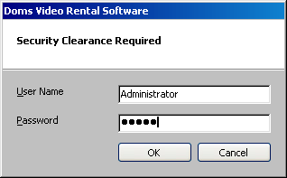

<div align="center">

## User Login Interace \(Updated\)


</div>

### Description

This is a sample of a User Login Interface that you can use when you plan to develop a secured application using a simple User Interface.

This user interface has an XP-like button. This also has the feature of using a Password-Enabled Access Database to store user accounts using DAO.

For VB5 users, you need to open a new project then just add the existing user control, add the form inluding the module...
 
### More Info
 
When you want to add User Accounts you can open the Access Database using the password AdmiN... Be careful when you input the password, take note that it is case-sensitive... The project's default User Name is Administrator and the default password is admin...


<span>             |<span>
---                |---
**Submitted On**   |2004-01-02 11:34:02
**By**             |[Domingo S\. Fugaban](https://github.com/Planet-Source-Code/PSCIndex/blob/master/ByAuthor/domingo-s-fugaban.md)
**Level**          |Beginner
**User Rating**    |4.3 (13 globes from 3 users)
**Compatibility**  |VB 5\.0, VB 6\.0
**Category**       |[Miscellaneous](https://github.com/Planet-Source-Code/PSCIndex/blob/master/ByCategory/miscellaneous__1-1.md)
**World**          |[Visual Basic](https://github.com/Planet-Source-Code/PSCIndex/blob/master/ByWorld/visual-basic.md)
**Archive File**   |[User\_Login168956122004\.zip](https://github.com/Planet-Source-Code/domingo-s-fugaban-user-login-interace-updated__1-42706/archive/master.zip)

### API Declarations

```
Option Explicit
Public Type POINTAPI
  X As Long
  Y As Long
End Type
Public Declare Function WindowFromPoint Lib "user32" ( _
  ByVal xPoint As Long, _
  ByVal yPoint As Long) As Long
Public Declare Function GetCursorPos Lib "user32" ( _
  lpPoint As POINTAPI) As Long
```


